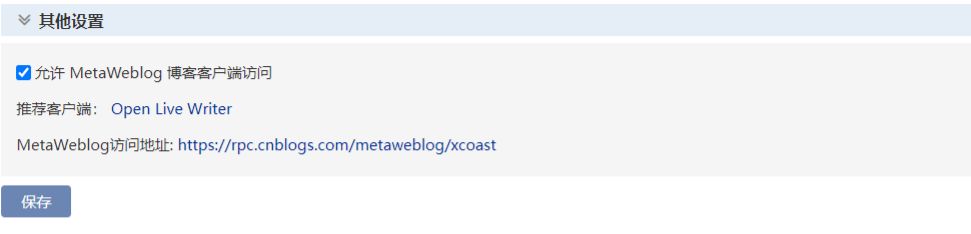
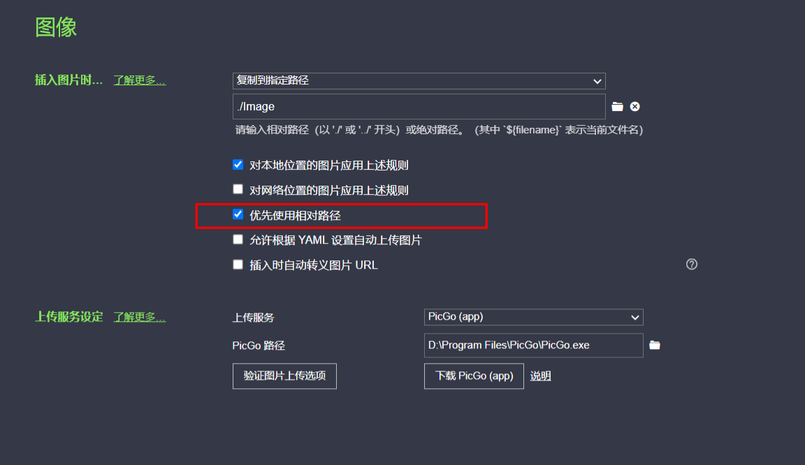
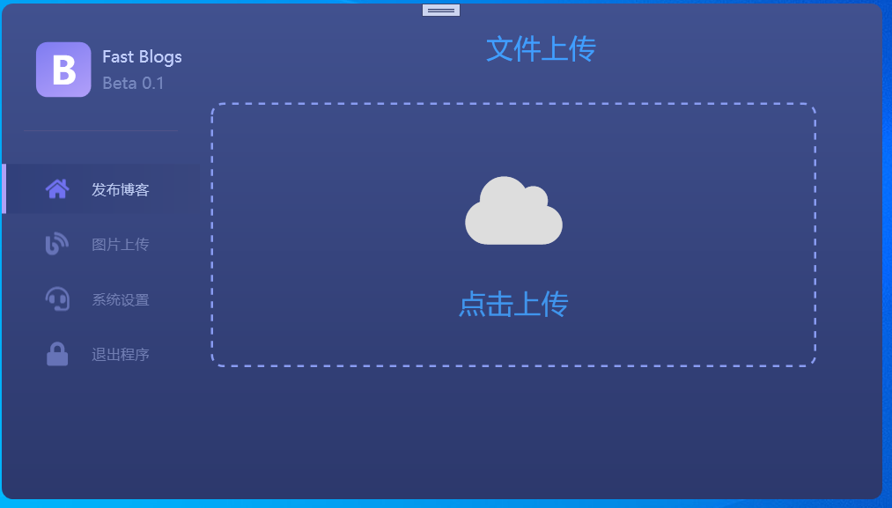
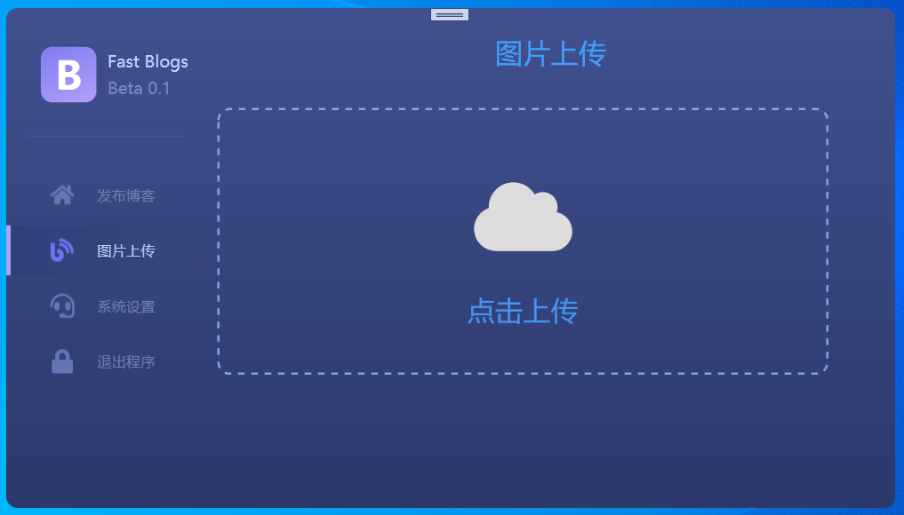
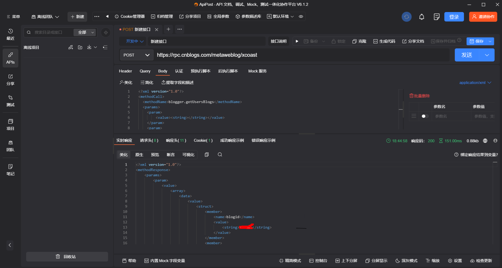

# FastBlogs

# 项目起因

目前因为Gitee不再支持图片上传，Typora+PicGo+Gitee的方式已经行不通，使用Github当作图床的话，对网络连接的要求又太高，所以决定开始使用博客园来存储笔记，本地还是使用Typora当作笔记工具，但是在把本地笔记上传到博客园时，图片需要手动一张一张复制到博客园，显得极其麻烦，最后决定自己实现一个类似PicGo功能的软件。

# 项目介绍

- 该项目是基于NET6的WPF框架，使用Prism实现的MVVM
- 目前只支持博客园的功能，其他相关博客网站暂无支持的计划
- 具体目前支持哪些功能下面有介绍，没有介绍到的说明不支持
- 项目是基于MetaWeblog API（MWA）编程接口的，博客园的详细接口说明如下
  - https://rpc.cnblogs.com/metaweblog/user

# 快速使用

## 配置用户信息

- 找到目录下`FastBlogs.json`文件

  ```json
  {
    "MetaWeblog": "MetaWeblog地址",
    "UserName": "用户名",
    "PassWord": "密码"
  }
  ```

  - 用户名：登录博客园后台找到用户名即可，不是显示昵称，看清楚！！！

  - MetaWeblog：登录博客园到博客设置界面，最下面其他设置，把允许`MetaWeblog`博客访问勾上，把`MetaWeblog`访问地址填入到配置文件中

    

## Typora设置

- 目前我自己用的是Typora来记笔记，需要设置一下图片在本地存放的路径，设置优先使用相对路径

  

## 博客发布

- 目前不支持直接上传到博客园，只会处理文件中的图片，把图片上传到博客园，并用网络路径替换本地路径，然后在文件的目录下生成一个同名的由`-cnblog`结尾的新文件，直接把新文件中的内容全部复制，然后在博客园的网页编辑器中粘贴，最后发布即可
- 目前文件处理只支持`md`结尾的文件，也就是`markdown`格式的文件
- 添加文件的方式支持2种：
  - 拖拽文件到点击上传的区域中松开鼠标即可，简单粗暴
  - 点击“点击上传”方框，添加文件



## 图片上传

- 上传图片成功后，界面会提示上传成功，并且自动把网络路径附在了剪贴板上，在需要图片的地方粘贴即可

- 支持的图片格式：jpg、png、gif、icon
- 添加文件的方式支持2种：
  - 拖拽图片到点击上传的区域中松开鼠标即可，简单粗暴
  - 点击“点击上传”方框，添加文件
  - 目前不支持剪贴板图片直接上传，后期考虑支持




# MetaWeblog API

## MetaWeblog API介绍

链接如下，自己看

- [XML-RPC简单理解与博客园的MetaWeblog协议 ](https://www.cnblogs.com/mq0036/p/12766789.html)
- [MetaWebLog API — 一个多平台文章同步的思路](https://www.cnblogs.com/ljysblog/p/12336878.html)
- [博客园自动化之MetaWeblog](https://zhuanlan.zhihu.com/p/412880353)
- [使用metaweblog API实现通用博客发布 之 API测试](https://www.cnblogs.com/robert-9/p/11428982.html)

## MetaWeblog API使用

目前据我所知调用方式分为2种：

- 通过`xml`进行调用，也就是`xmlrpc`
- 通过代理类进行`rpc`调用

### `XML`调用

- 通过`http`发送`post`请求，请求`Body`为`xml`格式的字符串



**请求体：**

- 对于博客园来说，调用`getUsersBlogs`方法时，`blogid`可以不填

```xml
<?xml version="1.0"?>
<methodCall>
  <methodName>blogger.getUsersBlogs</methodName>
  <params>
    <param>
        <value><string></string></value>
    </param>
    <param>
        <value><string>用户名</string></value>
    </param>
    <param>
        <value><string>密码</string></value>
    </param>
  </params>
</methodCall>
```

**返回结果：**

```xml
<?xml version="1.0"?>
<methodResponse>
    <params>
        <param>
            <value>
                <array>
                    <data>
                        <value>
                            <struct>
                                <member>
                                    <name>blogid</name>
                                    <value>
                                        <string>7545</string>
                                    </value>
                                </member>
                                <member>
                                    <name>url</name>
                                    <value>
                                        <string>https://www.cnblogs.com/xcoast/</string>
                                    </value>
                                </member>
                                <member>
                                    <name>blogName</name>
                                    <value>
                                        <string>xcoast</string>
                                    </value>
                                </member>
                            </struct>
                        </value>
                    </data>
                </array>
            </value>
        </param>
    </params>
</methodResponse>
```

### 代理调用

- 新建一个代理接口，接口中定义方法，方法的参数以及返回值与`MetaWeblog`接口文档中的定义一致

- 安装一个包，`FreemanKe.XmlRpc`

- 开始调用

  - 我这里定义的接口名字叫做`IMetaWeblog`

  ```c#
  IMetaWeblog proxy = (IMetaWeblog)XmlRpcProxyGen.Create(typeof(IMetaWeblog));
  XmlRpcClientProtocol cp = (XmlRpcClientProtocol)proxy;
  cp.Url = url;
  BlogInfo[] blogInfo = proxy.GetUsersBlogs(appKey, username, password);
  ```


# 待解决问题

1. 目前当用户名和密码有一个错误时，会报错`fault response contains struct value with missing non-optional members: FaultCode FaultString [fault response : struct mapped to type Fault]”`，这样获取不到真正的错误提示，比如当使用`http`发送`post`请求，请求用户名的信息的时候，如果有错误会提示下面的信息，有明确的提示信息，目前我通过代理调用时，不知道如何优雅的获取到真正的错误信息，如果有人知道，请教一下，万分感谢

   ```xml
   <?xml version="1.0"?>
   <methodResponse>
       <fault>
           <value>
               <struct>
                   <member>
                       <name>faultCode</name>
                       <value>
                           <i4>500</i4>
                       </value>
                   </member>
                   <member>
                       <name>faultString</name>
                       <value>
                           <string>! wrong username/password</string>
                       </value>
                   </member>
               </struct>
           </value>
       </fault>
   </methodResponse>
   ```

   


